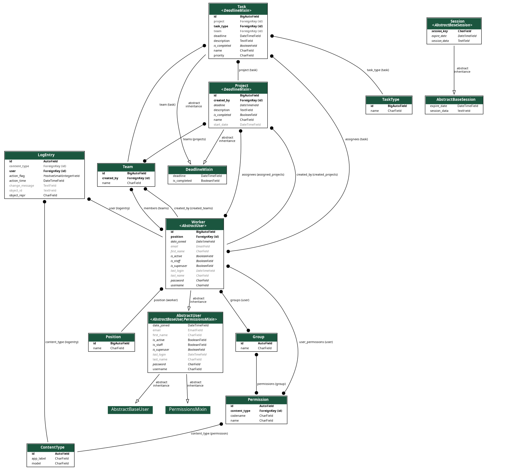

# ITCompanyTaskManager

## ITTaskManager

**ITTaskManager** is a project management tool designed to help teams efficiently manage tasks, projects, and team
members. This application facilitates the planning, tracking, and collaboration of tasks and projects, making it easier
for teams to work together and achieve their goals.

## Check it out!

[taskmanager Deployed to Render](https://itcompanytaskmanager.onrender.com/)

## Installation

Run the following commands in your terminal:

```bash
git clone https://github.com/Fedot0v/ITCompanyTaskManager.git 
cd ITCompanyTaskManager 
python3 -m venv venv 
source venv/bin/activate 
pip3 install -r requirements.txt 
python3 manage.py runserver 
```

After running this command, you can open the project in your browser at `http://127.0.0.1:8000/`.

## Testing with Data

To load the prepared data from the fixture, use the following command:

```bash
python manage.py manage.py loaddata taskmanager_db.json
```

After loading data from the fixture you can use the following superuser:
```
login: SuperUser
password: SuperUserpassword123
```

## Features

**ITCompanyTaskManager** includes the following features:

### Deadline Management

- Adds deadline and completion status functionality.

### User Authentication

- **User Registration**: Allows new users to create accounts with their personal details and a chosen position.
- **Login/Logout**: Secure login and logout functionality for users.
- **Profile Management**: Users can view and update their profile information, including username, email, and position.

### Task Management

- **Task Creation and Editing**: Create and update tasks with details such as name, description, deadline, priority, and
  task type.
- **Task Search**: Filter tasks by name, assignees, task type, and status (Pending, Completed, Overdue).
- **Task Assignment**: Assign tasks to one or more workers and associate tasks with projects and teams.
- **Task Detail and Deletion**: View detailed information about tasks and delete tasks if necessary.

### Project Management

- **Project Creation and Editing**: Create, update and delete projects. Project can be associated them to teams and
  workers.
- **Project Search**: Filter projects by name, start date and deadline.

### Worker Management

- **Worker Editing**: Update worker details.
- **Worker Search**: Search for workers by username or last name.

### Team Management

- **Team Creation and Editing**: Create, delete and manage teams, including adding and removing members.
- **Team Search**: Filter teams by name and start date.

### Home Page

- **Overview**: On the main page, user can view the total number of his tasks, pending tasks and completed tasks.

### Access Control

- **Permission-Based Access**: Restrict access to certain views based on user roles and ownership, ensuring that users
  can only interact with resources they have permission for.

## DB Structure

